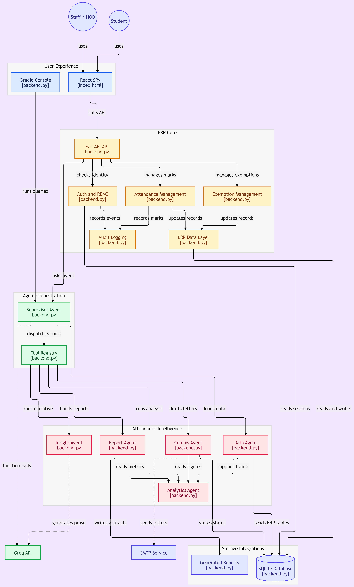
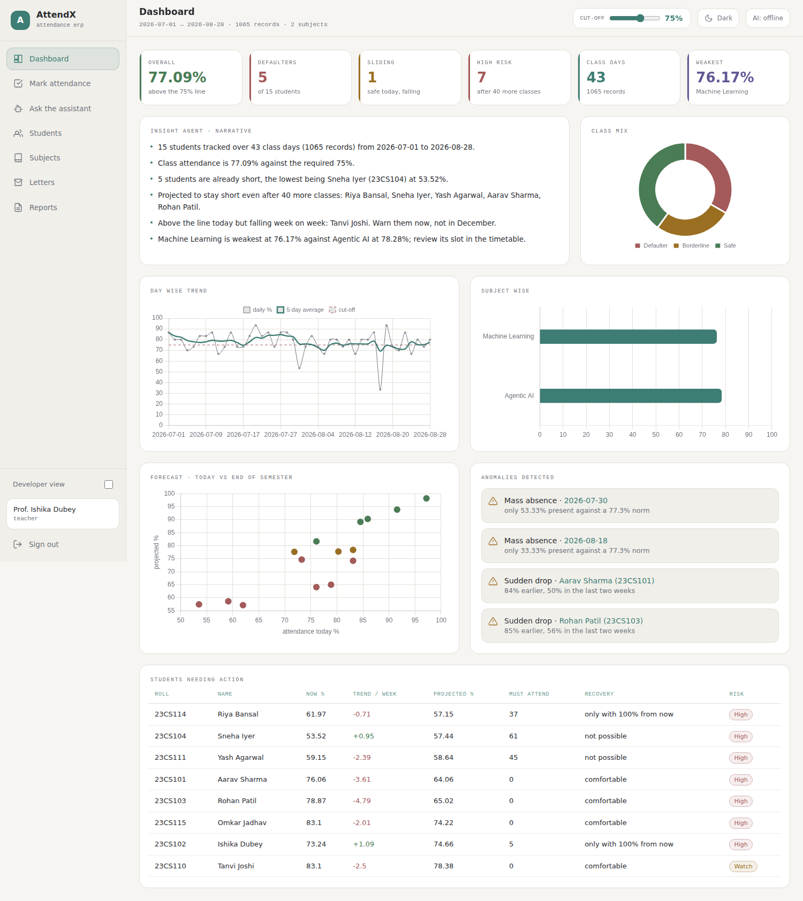
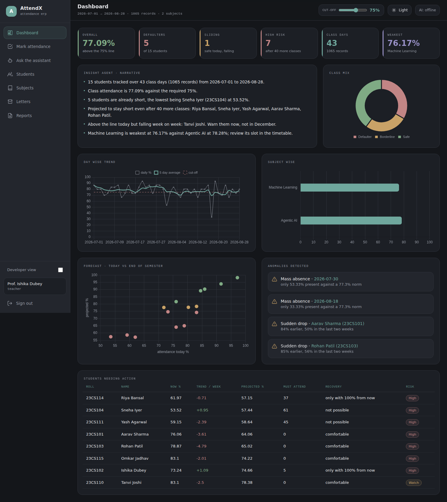
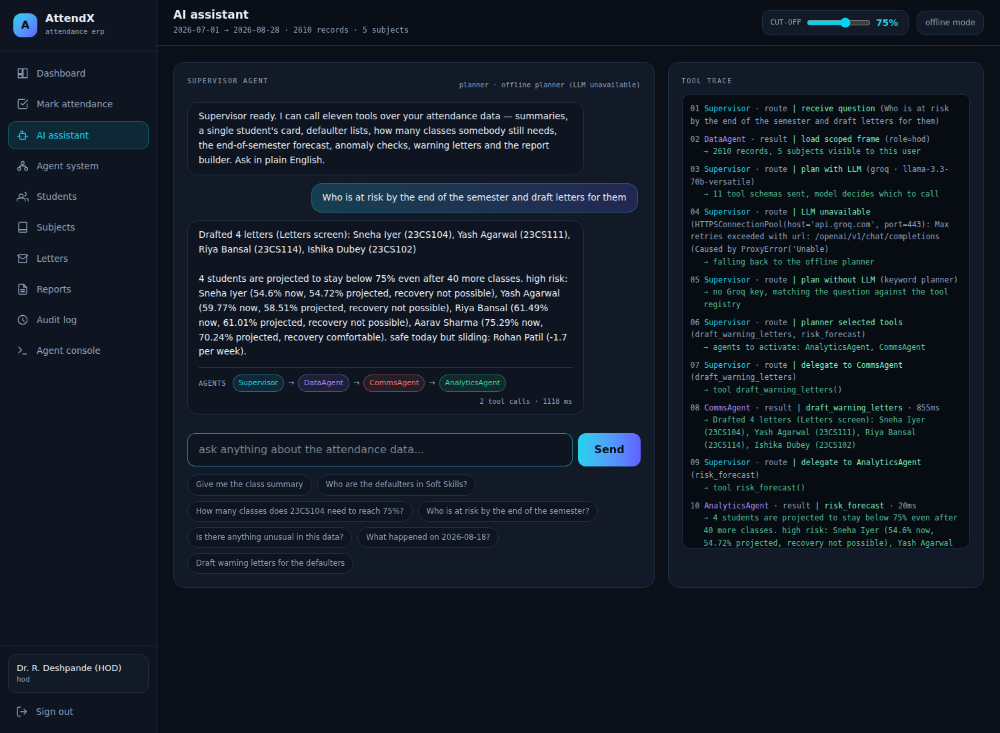
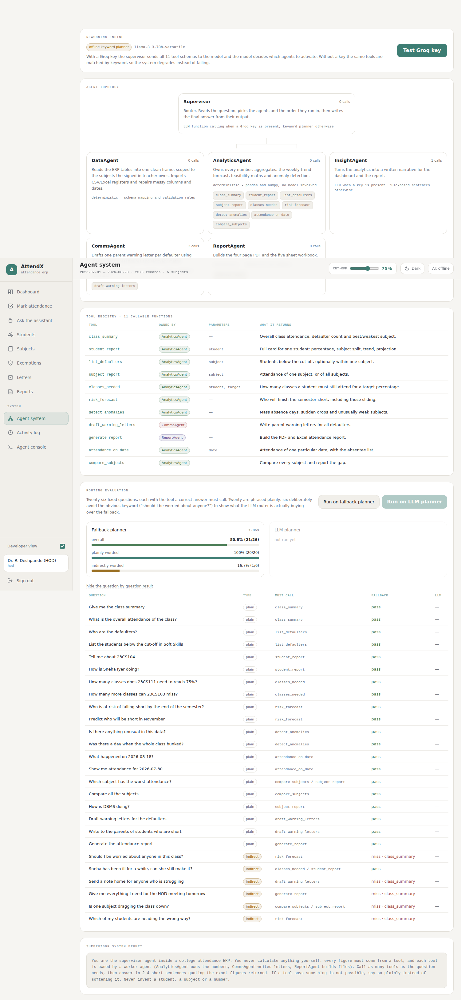
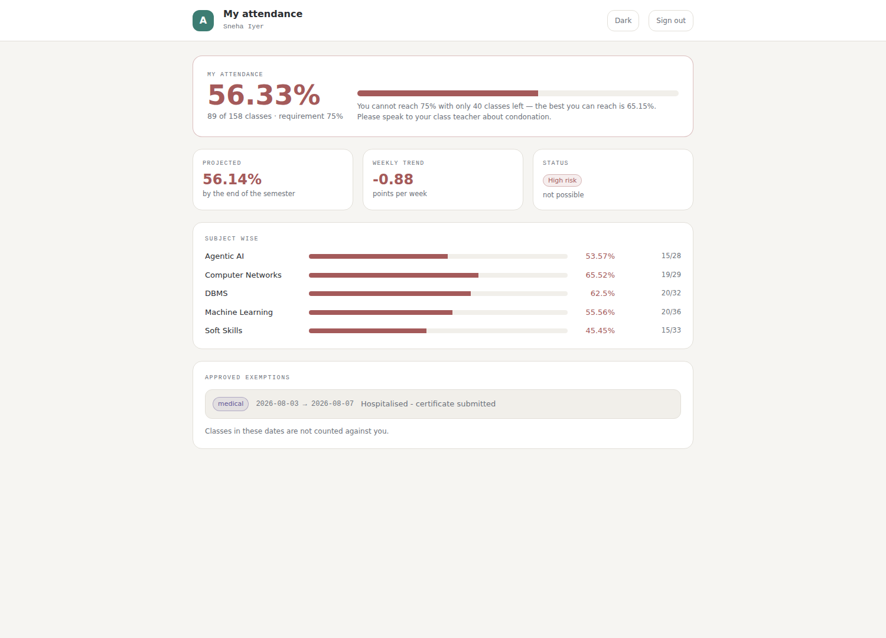
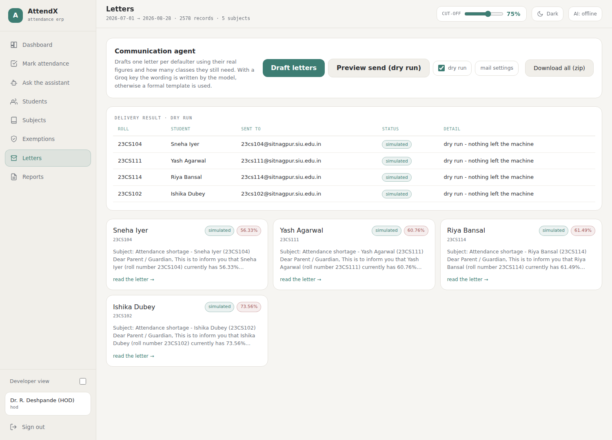

<div align="center">

# AttendX

**An attendance ERP where an AI agent decides which of its eleven tools to run — and shows you its working.**

Six specialised agents behind a supervisor that routes with real LLM function calling,
falls back to a keyword planner when there is no key, and never invents a number.

[](https://www.python.org/)
[](https://fastapi.tiangolo.com/)
[](https://react.dev/)
[](https://groq.com/)
[](tests/test_attendx.py)
[](LICENSE)

</div>

---

## The problem

Colleges detect attendance shortage in November, when nothing can be done about it.
By then a student at 55% cannot reach 75% even by attending every remaining class —
the arithmetic has already closed.

**AttendX moves that detection to September.** It forecasts where each student will
land, separates *"needs to attend 12 more"* from *"mathematically cannot recover"*,
and drafts the parent letter for the first group instead of producing another
spreadsheet nobody reads.

---

## Architecture



The design rule the whole project follows: **the supervisor owns decisions and owns no
data; the workers own capabilities and make no decisions.** Every tool belongs to
exactly one agent, so *"which agent handled this request"* is always answerable from
the trace — not a guess.

```
question ──▶ DataAgent (scope rows to this user's subjects)
                 │
                 ▼
          Supervisor ──── Groq function calling ────▶ picks tools
                 │        (keyword planner if no key)
      ┌──────────┼──────────┬───────────────┐
      ▼          ▼          ▼               ▼
 AnalyticsAgent  CommsAgent  ReportAgent  InsightAgent
      │          │          │               │
      └──────────┴────┬─────┴───────────────┘
                      ▼
            tool results ──▶ Supervisor writes the answer
                             from tool output only
```

| Agent | Owns | Reasoning | Tools |
|---|---|---|---|
| **DataAgent** | reading the ERP tables into one clean frame, scoped to the signed-in user; CSV/Excel import | deterministic | — |
| **AnalyticsAgent** | every number: aggregates, weekly-trend forecast, feasibility maths, anomaly detection | deterministic (pandas/numpy) | 9 |
| **InsightAgent** | the written narrative on the dashboard and in the report | LLM or rule engine | — |
| **CommsAgent** | parent warning letters and their delivery | LLM wording or template | 1 |
| **ReportAgent** | the 4-page PDF and 5-sheet workbook | deterministic | 1 |
| **Supervisor** | routing, ordering, final wording | **LLM function calling** | — |

---

## What it actually does

### Predicts the shortage before it is unfixable

Fits a line through each student's weekly attendance and projects it over the classes
still left in the semester. The interesting class isn't the student already below the
line — it's the one at **77% falling three points a week**, flagged `Watch`.

### Refuses to give impossible advice

`classes_needed` is compared against `best_possible`. If a student needs 142 classes and
40 remain, the system says so and routes it to condonation instead of generating an
encouraging sentence that is arithmetically false.

> *"Sneha Iyer is at 54.6% and needs 142 classes for 75%, but only 40 remain. The best
> reachable figure is 63.08%, so this is a condonation case."*

### Detects what a percentage hides

Mass-absence days (2σ below the class norm), students who dropped 20+ points in the last
fortnight, and subjects the entire class avoids.

### Closes the loop

Drafts one letter per defaulter using their real figures, **dry run by default**, real
SMTP when configured, and stores per-letter status so *"was the parent told?"* is
answerable.

### Handles the case where the honest answer is "this shouldn't count"

Approved medical leave, college events or internships remove those classes from the
**denominator**. The register is never rewritten; the exemption sits beside it and is
auditable.

---

## Screens

<table>
<tr>
<td width="50%"><br/><sub><b>Dashboard</b> — KPIs, narrative, forecast scatter, anomalies</sub></td>
<td width="50%"><br/><sub><b>Both themes</b> — follows your OS, charts included</sub></td>
</tr>
<tr>
<td><br/><sub><b>Assistant</b> — every answer carries the agent chain; <i>show working</i> opens the step trace</sub></td>
<td><br/><sub><b>Agent system</b> — topology, tool registry, routing evaluation</sub></td>
</tr>
<tr>
<td><br/><sub><b>Student view</b> — read-only, their own numbers only</sub></td>
<td><br/><sub><b>Letters</b> — drafted, dry-run previewed, status tracked</sub></td>
</tr>
</table>

---

## Routing evaluation

Twenty-six fixed questions, each with the tool a correct answer must call. Twenty are
phrased plainly; **six deliberately avoid the obvious keyword** — because an evaluation
that only tests the easy half tells you nothing.

| Planner | Plainly worded | Indirectly worded | Overall |
|---|---|---|---|
| Keyword fallback | **100%** (20/20) | **16.7%** (1/6) | 80.8% |
| Groq LLM planner | run it yourself with a key | | |

> *"Should I be worried about anyone in this class?"* → the fallback answers with a class
> summary; the tool it should have called is `risk_forecast`. That gap is the argument
> for the LLM router, measured rather than asserted.

Runnable from the **Agent system** screen, or `POST /api/agent/eval`.

---

## Quick start

```bash
git clone https://github.com/ishikadubey1105/Agentic-AI-CA3.git
cd Agentic-AI-CA3
pip install -r requirements.txt
python backend.py
```

Open **http://127.0.0.1:8000**

| Login | Password | Sees |
|---|---|---|
| `ishika` | `teach123` | only her allotted subjects |
| `hod` | `admin123` | every subject, plus student and subject management |
| `23cs104` | `23cs104` | one student's own attendance, read-only |

First run creates and seeds the database — 15 students, 5 subjects, ~2,600 records,
with three chronic defaulters, two students who start well and slide, and one mass-bunk
day planted so the analytics have something true to find. Every student gets a login
automatically (roll number as both username and password).

**It runs with no internet.** React, Chart.js, Tailwind and Babel are vendored in
`frontend/vendor/`, and every agent has a deterministic fallback.

---

## Where the Groq API key is used

The key is **optional** — without it the system runs the keyword planner and rule-based
wording. With it, three things change:

| Where | What the key does | Code |
|---|---|---|
| **Supervisor routing** | sends all 11 tool schemas with `tool_choice: "auto"` and lets the model pick the tools and fill their arguments, looping up to 4 rounds | `Supervisor._llm()` → `LLM.with_tools()` |
| **InsightAgent narrative** | writes the dashboard and report bullets from a JSON of the computed facts | `InsightAgent.summary()` → `LLM.plain()` |
| **CommsAgent letters** | words the parent letter from the student's real figures | `CommsAgent._body()` → `LLM.plain()` |

Three ways to supply it, all optional:

```bash
# 1. environment variable (used by the deployed version)
export GROQ_API_KEY="gsk_..."

# 2. in the UI: top bar → "AI: offline" → paste → Test key
#    (validates against /openai/v1/models, picks a live model, reports round-trip ms)

# 3. per request, for the evaluation harness
POST /api/agent/eval  {"use_llm": true, "api_key": "gsk_..."}
```

The key is **never written to a file or committed** — it lives in an environment
variable on the server, or in the browser's localStorage for the session. `LLM._post()`
is the only place it is attached to a request, and every call falls back to the
deterministic path on 401, 429 or a network failure.

---

## Tests

```bash
pytest -q          # 31 passing, ~10 seconds
```

The suite runs against a throwaway database in a temp folder. It tests the eligibility
maths as a **property** — attending exactly `classes_needed` classes must land on the
target and one fewer must not — plus the forecast, exemptions leaving the denominator,
role scoping (a teacher gets `403` on another teacher's roster; a student sees only
their own rows), tool/agent registry consistency, the letter workflow, and that every
number in an agent answer exists in a tool result.

---

## Tech

**Backend** FastAPI · SQLite · pandas · numpy · matplotlib · openpyxl · PBKDF2 auth with
bearer sessions
**Frontend** React 18 · Chart.js · Tailwind v4 — no build step, all vendored
**AI** Groq (`llama-3.3-70b-versatile`) with OpenAI-compatible function calling, and a
model-fallback chain
**Also** a Gradio console mounted at `/agent` inside the same FastAPI process, for
debugging the tool layer without the ERP around it

---

## Docs

| File | What's in it |
|---|---|
| [`AGENTS.md`](AGENTS.md) | how the six agents work, the routing flow, what happens on the LLM path vs the fallback, where to look in the code |
| [`REVIEW.md`](REVIEW.md) | an honest self-review — scored 8.5/10, what was fixed to reach 10, and what is *still* imperfect |
| [`DEPLOY.md`](DEPLOY.md) | Render / Hugging Face / Docker, and why Vercel cannot host this |

---

## Known limits

Stated plainly, because a README that claims perfection is not worth reading:

- The seed data is **synthetic** — a test fixture, with the generator visible in
  `seed_if_empty()`.
- `CLASSES_LEFT` is a constant; it should come from a timetable.
- Sessions are bearer tokens in `localStorage`; production would use httpOnly cookies,
  CSRF protection and HTTPS.
- No undo — attendance can be overwritten (with a warning) but not rolled back.
- The forecast is a linear fit on ~8 weekly points, chosen for interpretability over
  accuracy at small *n*.

---

<div align="center">

Built by **[Ishika Dubey](https://github.com/ishikadubey1105)** · B.Tech CSE (AI & ML),
Symbiosis Institute of Technology, Nagpur
Agentic AI and Automation · CA-3

</div>
